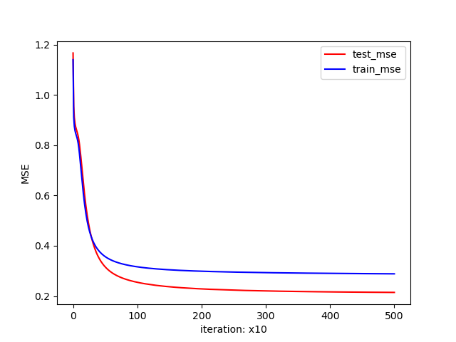
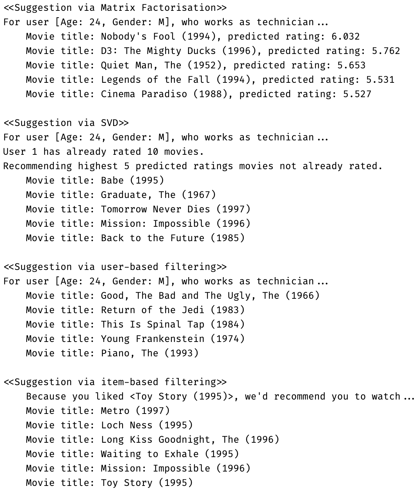

# Machine Learning Term Project - Suggestion program 
--
Machine learning Term project: Movie suggestion program.  

**Used algorithms**: [*Matrix factorisation, SVD, User-based suggestion*]  
**Anchor algorithms**: [*Various classification algorithms*]

## Result description 
--

> Training dataset: [ml100k](https://grouplens.org/datasets/movielens/100k/)  
> Test MSE: 0.2174, iteration: 5'000, **No overfitted**  
>   
> You can get various suggestion like below figures  
>  

